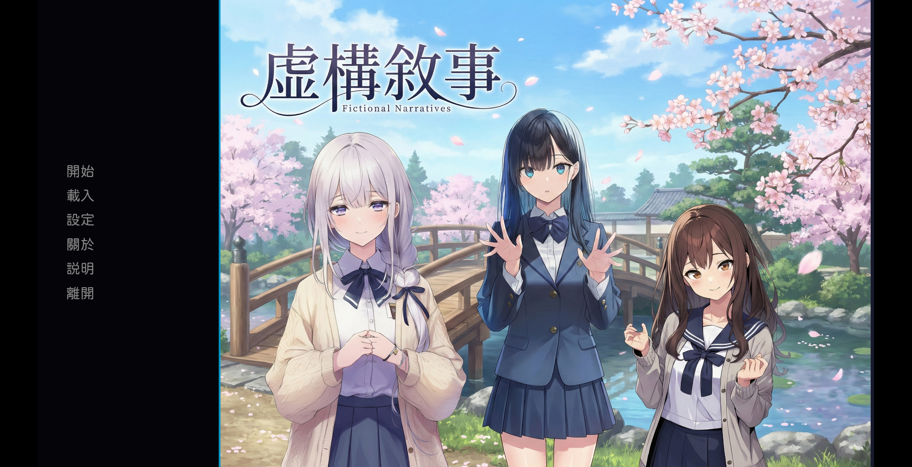
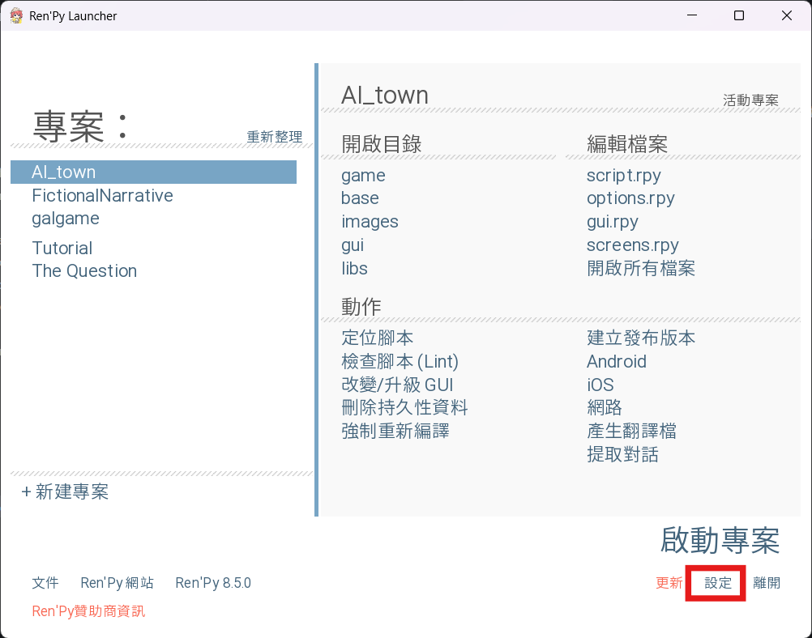
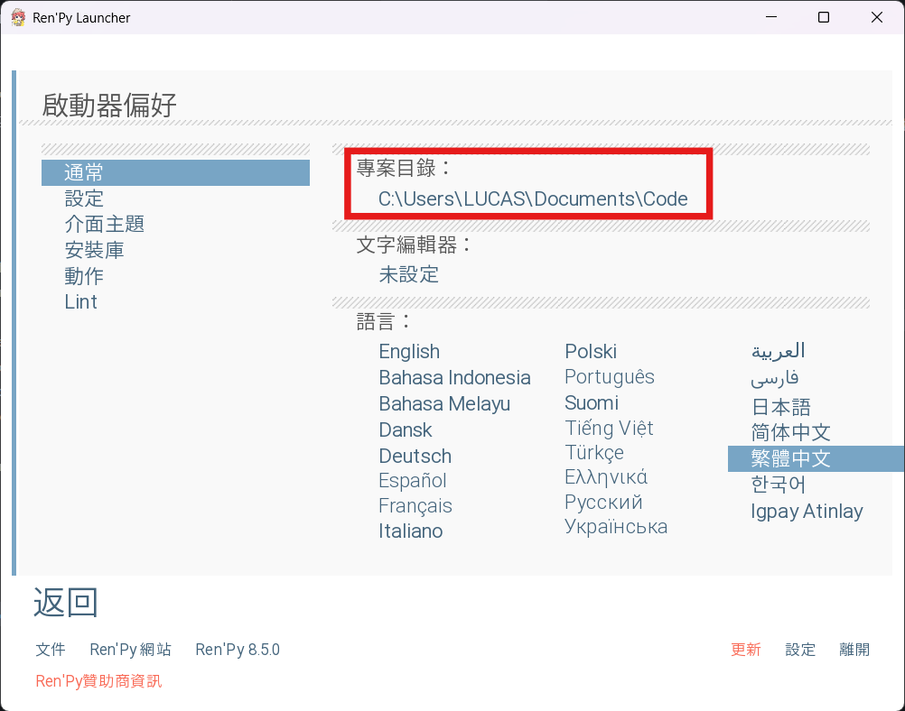
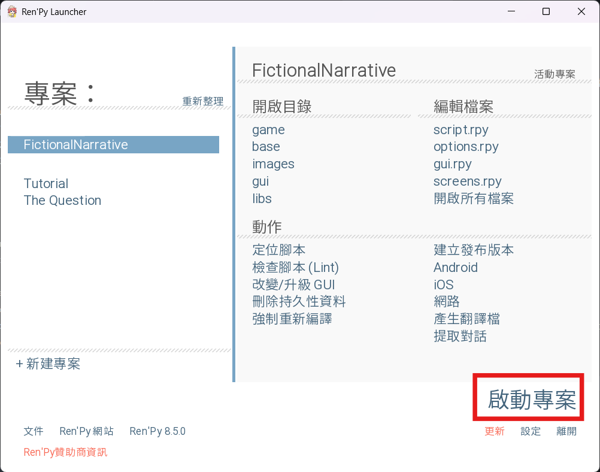
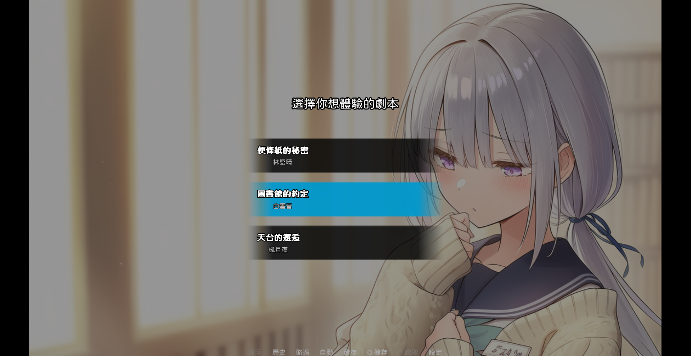
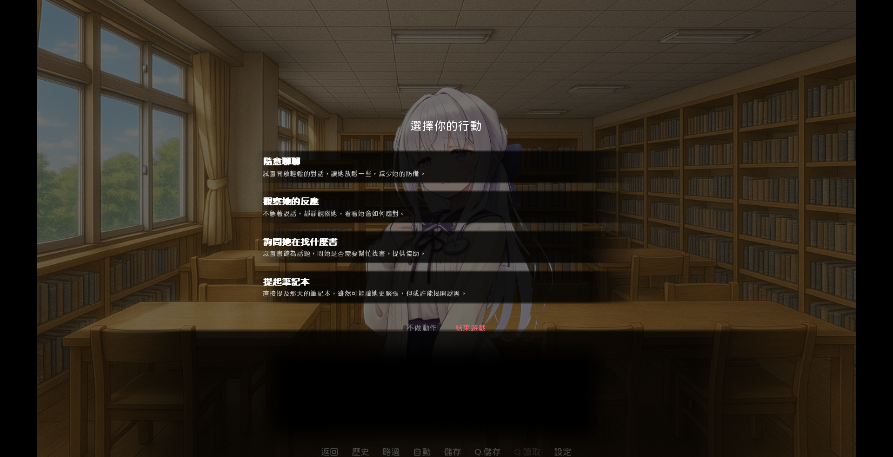
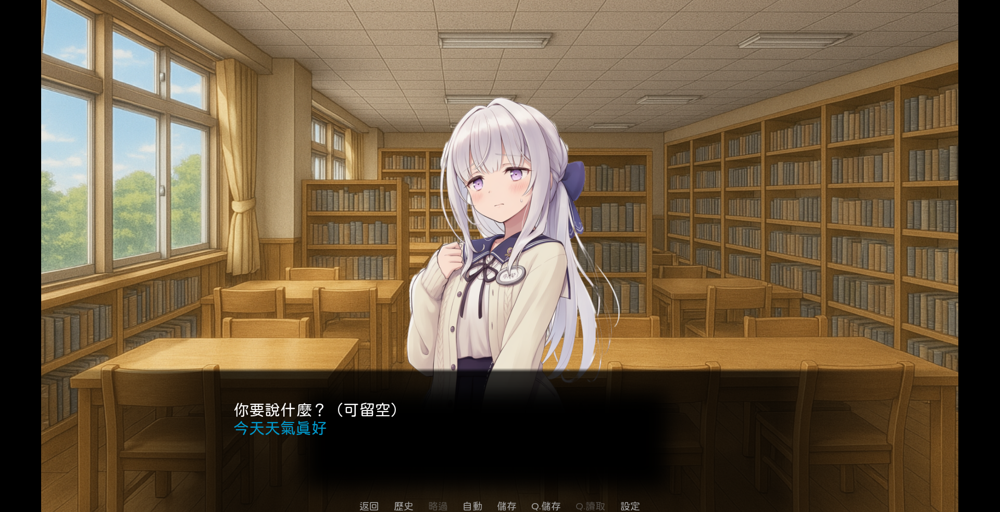
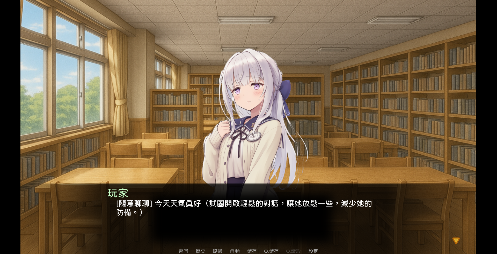

# 虛構敘事 FictionalNarrative

## 專案簡介
這是一個基於 Ren'Py 8.5.0 遊戲引擎，透過串接 Google Gemini API 實現 AI 無限生成遊戲內容的劇情遊戲
- /game - 遊戲主資料夾
    - /gui - UI 設定
    - /images - 人物、背景圖片和人物設定檔案
    - prompt.txt - 人物共用提示詞
    - story1.txt - 人物一提示詞
    - story2.txt - 人物二提示詞
    - story3.txt - 人物三提示詞
    - config.json - 遊戲設定檔案

## 安裝指南
開啟專案資料夾，將 Gemini API Key 放入 `game/config.json` 的 `api_key` 欄位中

下載並安裝 [Ren'Py 引擎](https://www.renpy.org/)

點擊設定

將專案目錄設定為此專案檔案的上級目錄(如果專案資料夾是在 `C:/Users/LUCAS/Downloads/FictionalNarrative`，則專案目錄設定為 `C:/Users/LUCAS/Downloads`)

返回後選擇專案並啟動

## 使用說明
開始遊戲後有三種角色劇情可以選擇

選擇角色劇情後會先生成一次初始劇情和選項

可以選擇四種互動選項或不做動作

選擇互動選項後可以輸入對話

送出後 Gemini API 就會根據對話生成下一次的劇情和選項，並且會根據對話選擇背景(`images/background`)和人物表情圖片(`images/scenario1~3`)

## 功能特點
- AI 無限生成劇情，沒有固定結局
- 角色圖片和背景根據劇情動態更換
- 高度自定義，可以修改 `prompt.txt` 和 `story1~3.txt` 來修改劇情和角色

## 貢獻
你可以自行修改原始碼並開啟 Pull Request，並沒有貢獻規範

## 授權
本專案採用 MIT License

## 致謝
* [956zs](https://github.com/956zs)
* [imyimang](https://github.com/imyimang)
* [R1ch1ang](https://github.com/R1ch1ang)
* aurelien_13.a